# TP1 - Operaciones Morfologicas

**Materia:** Vision Artificial  
**Carrera:** Licenciatura en Automatizacion y Control  
**Facultad:** Universidad Tecnologica Nacional - Facultad Regional Cordoba  
**Trabajo Practico:** TP1 - Operaciones Morfologicas  
**Alumno:** Cristian Gonzalo Vera  
**Legajo:** 420581  
**Ano:** 2026

## 1. Introduccion

El objetivo de este trabajo practico es implementar y analizar una secuencia de operaciones morfologicas aplicadas al procesamiento de imagenes. El estudio se realiza sobre dos casos complementarios:

- una **imagen real**, para observar el comportamiento del algoritmo en condiciones no ideales,
- una **imagen sintetica**, para validar el comportamiento teorico en un escenario controlado.

El trabajo no se limita a ejecutar codigo. Tambien busca justificar tecnicamente cada etapa del pipeline y analizar como cambia la estructura de los objetos segun el kernel utilizado.

## 2. Fundamento teorico resumido

Una imagen digital puede representarse como una matriz de pixeles. En imagenes color, cada pixel posee varios canales; en una imagen en escala de grises, cada pixel queda representado por un unico valor de intensidad. Esta simplificacion es importante porque la binarizacion y la morfologia operan mas naturalmente sobre una unica componente de intensidad o sobre una mascara binaria resultante.

La binarizacion global mediante el metodo de Otsu busca separar automaticamente la imagen en dos clases a partir del histograma. El criterio del algoritmo consiste en elegir el umbral que mejor separa los pixeles de fondo y objeto, minimizando la varianza intraclase. Su comportamiento suele ser mejor cuando el histograma presenta una tendencia bimodal.

Sobre la imagen binaria se aplican operaciones morfologicas:

- **Erosion:** reduce regiones blancas y elimina detalles pequenos.
- **Dilatacion:** expande regiones blancas y refuerza conectividad.
- **Apertura:** erosion seguida de dilatacion; util para remover ruido externo.
- **Cierre:** dilatacion seguida de erosion; util para rellenar huecos y consolidar regiones.

El elemento estructurante o kernel define la vecindad considerada por estas operaciones. En este TP se comparan dos casos:

- kernel cuadrado `3x3`,
- kernel rectangular `5x1`.

El segundo introduce una accion direccional, lo que permite discutir anisotropia.

## 3. Metodologia

El pipeline aplicado de forma independiente a ambos casos fue:

1. conversion a escala de grises,
2. binarizacion global con Otsu,
3. analisis del histograma con umbral marcado,
4. erosion con kernel `3x3`,
5. dilatacion con kernel `3x3`,
6. apertura con kernel `3x3`,
7. cierre con kernel `3x3`,
8. repeticion del bloque morfologico con kernel `5x1`,
9. comparacion entre casos y entre kernels.

Los resultados visuales y metricos utilizados en esta presentacion fueron obtenidos a partir del prototipado desarrollado en `c_prototipado/` y se incluyen aqui como evidencia documental final.

## 4. Casos de estudio

### 4.1 Imagen real

Se eligio una imagen real con un objeto principal bien definido sobre un fondo relativamente simple. Este caso permite estudiar:

- el efecto de pequenas variaciones de iluminacion,
- la presencia de bordes menos ideales,
- y la respuesta morfologica en un escenario mas cercano a una aplicacion practica.

  

### 4.2 Imagen sintetica

Para el caso sintetico se utilizo una escena generada por codigo, con fondo negro y figuras geometricas de alto contraste. Esta imagen fue diseniada para dejar visibles:

- una figura rectangular con hueco interno,
- una figura circular independiente,
- una pequena brecha horizontal entre componentes,
- y puntos pequenos a modo de ruido controlado.

Esto permite observar con mayor claridad el comportamiento teorico de las operaciones morfologicas.

  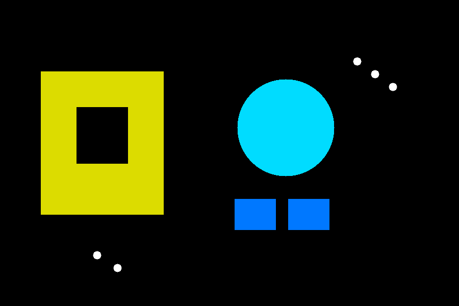

## 5. Desarrollo del caso real

### 5.1 Escala de grises, Otsu e histograma

La conversion a escala de grises conserva adecuadamente la estructura general del objeto. Sobre esa imagen se aplica Otsu, obteniendo una mascara binaria util para el resto del procesamiento. El histograma permite visualizar la distribucion de intensidades y ubicar el umbral calculado automaticamente.

<table>
  <tr>
    <td align="center"> Original</td>
    <td align="center">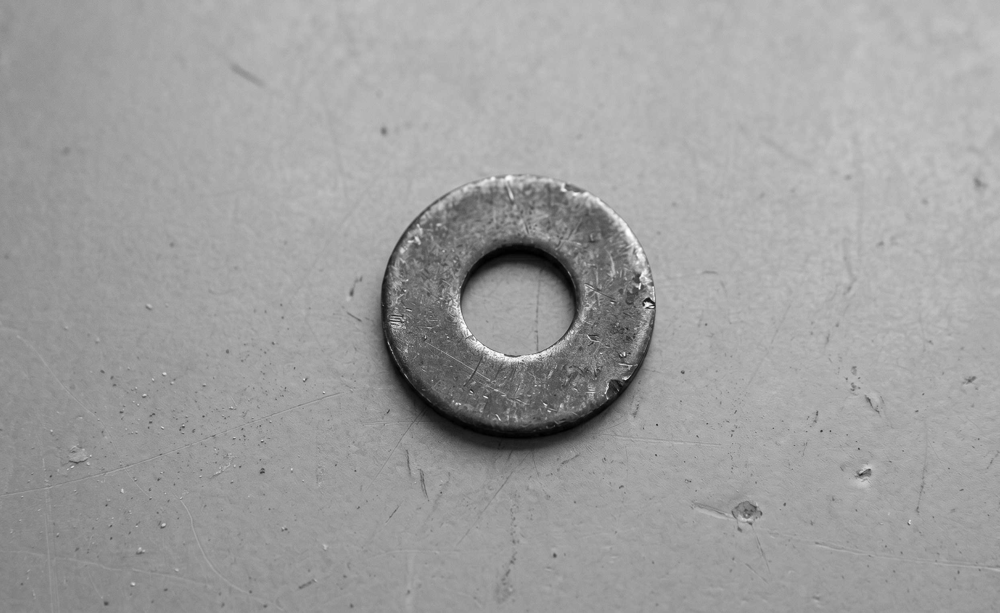 Escala de grises</td>
  </tr>
  <tr>
    <td align="center">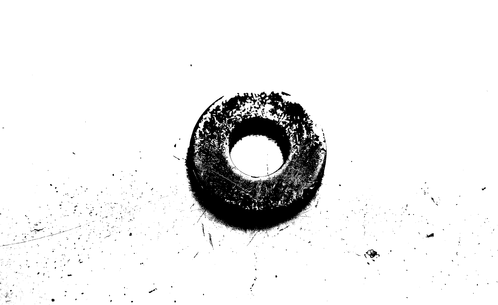 Binaria con Otsu</td>
    <td align="center">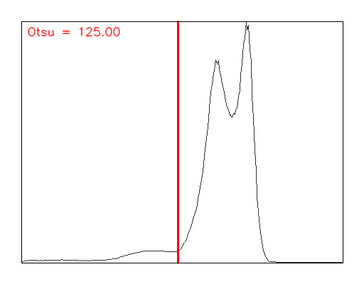 Histograma con umbral</td>
  </tr>
</table>

**Lectura del resultado:**  
La segmentacion obtenida es util aunque no perfectamente limpia, lo cual es esperable en una imagen real. Precisamente esta condicion vuelve interesante el analisis morfologico posterior.

### 5.2 Operaciones morfologicas con kernel `3x3`

El kernel `3x3` genera una accion relativamente uniforme en todas las direcciones. Sus resultados fueron:

<table>
  <tr>
    <td align="center">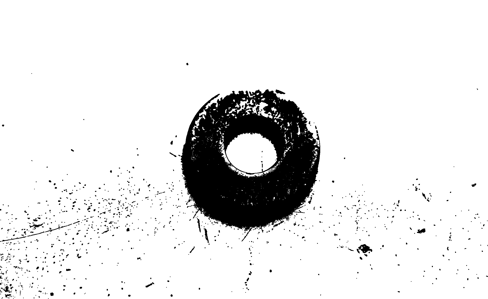 Erosion 3x3</td>
    <td align="center">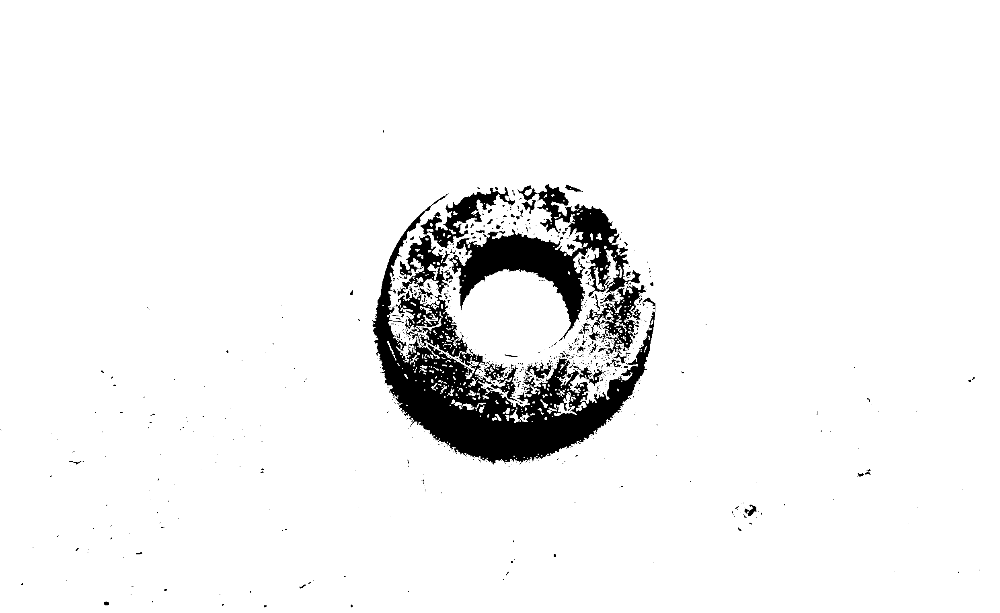 Dilatacion 3x3</td>
  </tr>
  <tr>
    <td align="center">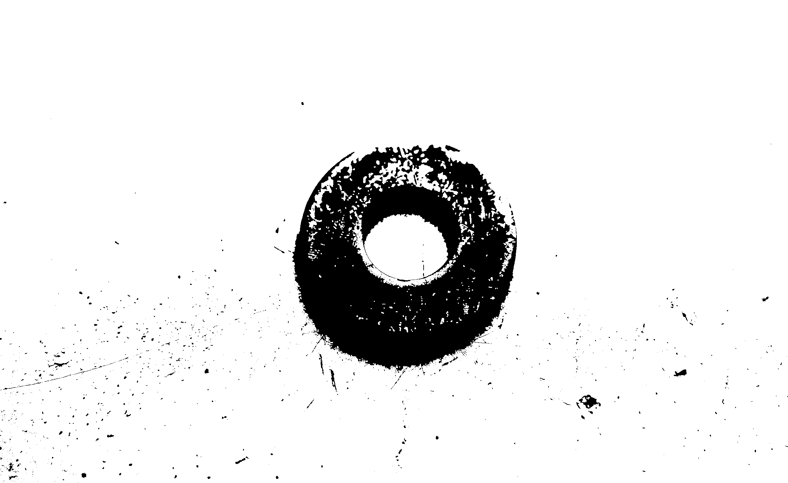 Apertura 3x3</td>
    <td align="center"> Cierre 3x3</td>
  </tr>
</table>

**Interpretacion:**

- La erosion retrae el contorno y reduce pequenas regiones blancas.
- La dilatacion expande el objeto y tiende a reforzar continuidad.
- La apertura elimina detalles externos pequenos.
- El cierre incrementa levemente la superficie blanca, consistente con el relleno de pequenas discontinuidades.

### 5.3 Analisis de sensibilidad con kernel `5x1`

El kernel `5x1` introduce una componente direccional horizontal. Los resultados fueron:

<table>
  <tr>
    <td align="center">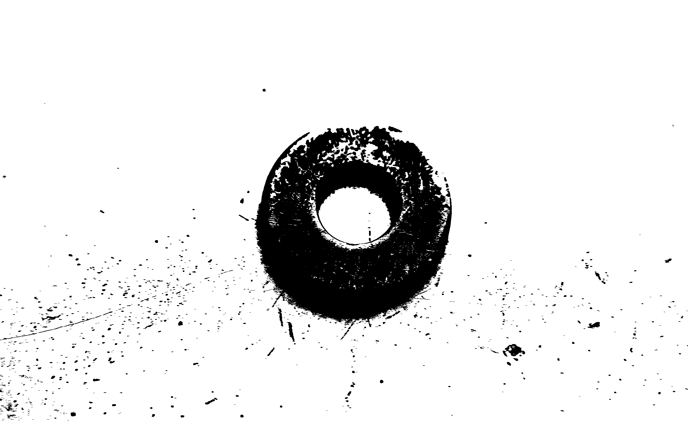 Erosion 5x1</td>
    <td align="center">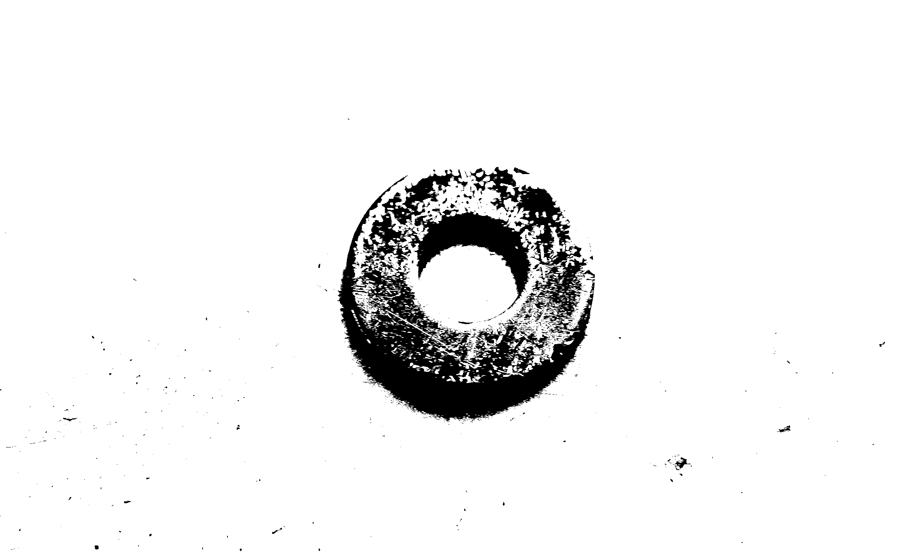 Dilatacion 5x1</td>
  </tr>
  <tr>
    <td align="center"> Apertura 5x1</td>
    <td align="center">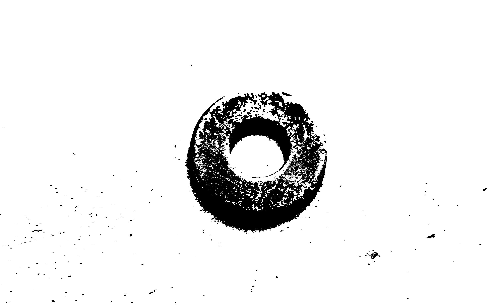 Cierre 5x1</td>
  </tr>
</table>

**Interpretacion:**

- El comportamiento general se conserva respecto del `3x3`, pero la accion deja de ser completamente uniforme.
- La anisotropia aparece atenuada por el ruido y las irregularidades propias de la imagen real.
- El caso muestra que la influencia del kernel no depende solo de su tamano, sino tambien de su forma.

### 5.4 Metricas del caso real

| Salida | Pixeles blancos |
|---|---:|
| Binaria Otsu | 3508309 |
| Erosion `3x3` | 3433014 |
| Dilatacion `3x3` | 3590449 |
| Apertura `3x3` | 3478393 |
| Cierre `3x3` | 3538889 |
| Erosion `5x1` | 3445736 |
| Dilatacion `5x1` | 3575892 |
| Apertura `5x1` | 3482514 |
| Cierre `5x1` | 3535192 |

### 5.5 Conclusion del caso real

El caso real confirma que el pipeline funciona en un escenario no ideal. La segmentacion con Otsu es suficientemente util y las operaciones morfologicas mantienen el comportamiento esperado. Esto demuestra que la morfologia matematica puede aplicarse con sentido practico aun cuando la escena no presenta condiciones perfectas.

## 6. Desarrollo del caso sintetico

### 6.1 Escala de grises, Otsu e histograma

En la escena sintetica, la separacion entre fondo y figuras es mucho mas limpia. Esto facilita la lectura del histograma y la accion del umbral de Otsu.

<table>
  <tr>
    <td align="center"> Original sintetica</td>
    <td align="center">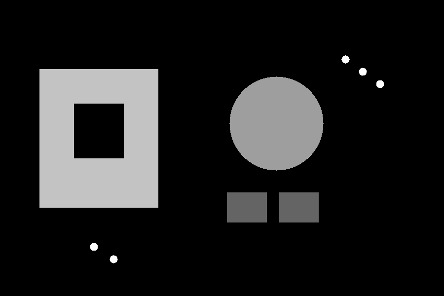 Escala de grises</td>
  </tr>
  <tr>
    <td align="center"> Binaria con Otsu</td>
    <td align="center">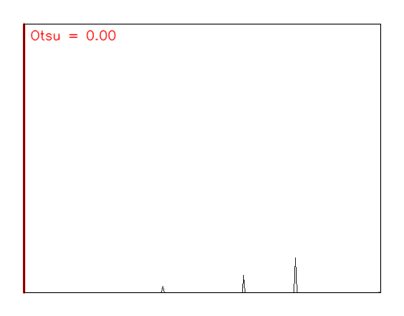 Histograma con umbral</td>
  </tr>
</table>

**Lectura del resultado:**  
La binarizacion es claramente mas estable que en la imagen real. Esto era esperable porque el fondo es uniforme y el contraste entre objetos y fondo es alto.

### 6.2 Operaciones morfologicas con kernel `3x3`

<table>
  <tr>
    <td align="center">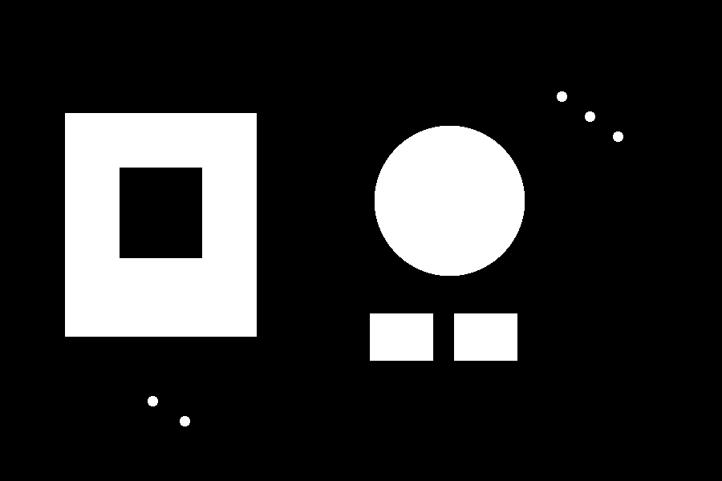 Erosion 3x3</td>
    <td align="center">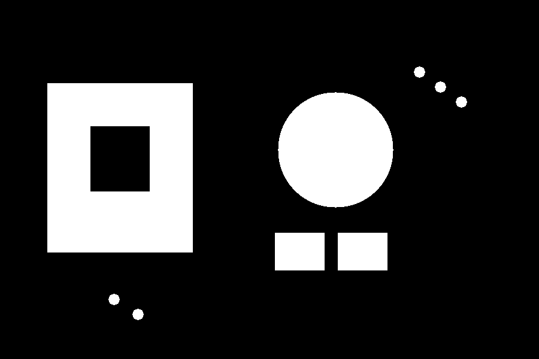 Dilatacion 3x3</td>
  </tr>
  <tr>
    <td align="center"> Apertura 3x3</td>
    <td align="center"> Cierre 3x3</td>
  </tr>
</table>

**Interpretacion:**

- La erosion reduce con claridad el espesor de las figuras.
- La dilatacion expande las regiones y refuerza continuidad.
- La apertura remueve el ruido pequeno sin alterar demasiado la estructura principal.
- El cierre mantiene practicamente intacta la escena principal, lo que muestra que el caso fue bien controlado.

### 6.3 Analisis de sensibilidad con kernel `5x1`

<table>
  <tr>
    <td align="center"> Erosion 5x1</td>
    <td align="center"> Dilatacion 5x1</td>
  </tr>
  <tr>
    <td align="center"> Apertura 5x1</td>
    <td align="center"> Cierre 5x1</td>
  </tr>
</table>

**Interpretacion:**

- El kernel `5x1` conserva la logica general de las operaciones morfologicas.
- Su efecto direccional se interpreta mejor en esta escena porque existe una pequena brecha horizontal incluida deliberadamente en el diseno.
- La anisotropia se observa de forma mas clara que en el caso real.

### 6.4 Metricas del caso sintetico

| Salida | Pixeles blancos |
|---|---:|
| Binaria Otsu | 95722 |
| Erosion `3x3` | 92638 |
| Dilatacion `3x3` | 98894 |
| Apertura `3x3` | 95698 |
| Cierre `3x3` | 95722 |
| Erosion `5x1` | 92598 |
| Dilatacion `5x1` | 98882 |
| Apertura `5x1` | 95710 |
| Cierre `5x1` | 95722 |

### 6.5 Conclusion del caso sintetico

El caso sintetico valida el comportamiento teorico del pipeline en condiciones controladas. La segmentacion es limpia, la interpretacion del histograma es mas directa y la comparacion entre kernels resulta mas clara. Por eso este caso complementa al real y permite explicar con mayor precision el efecto de cada operacion.

## 7. Comparacion entre casos y entre kernels

La comparacion final permite extraer varias observaciones:

- El caso real presenta una respuesta mas irregular, afectada por ruido, textura e iluminacion.
- El caso sintetico exhibe un comportamiento mas limpio y predecible.
- El kernel `3x3` produce una accion mas uniforme.
- El kernel `5x1` introduce un comportamiento direccional, es decir, anisotropico.

En terminos metricos, en ambos casos:

- la erosion reduce la cantidad de pixeles blancos,
- la dilatacion la incrementa,
- la apertura remueve detalles pequenos,
- y el cierre tiende a consolidar regiones.

Sin embargo, la diferencia entre kernels se interpreta mejor en la imagen sintetica, porque alli el efecto no queda enmascarado por variaciones del entorno real.

## 8. Conclusiones finales

A partir del desarrollo realizado, pueden establecerse las siguientes conclusiones:

1. La conversion a escala de grises es un paso indispensable porque simplifica la informacion visual y prepara la imagen para la binarizacion.
2. El metodo de Otsu permite obtener una mascara binaria util en ambos casos, aunque responde mejor cuando el histograma presenta una separacion mas clara entre fondo y objeto.
3. Las operaciones morfologicas modifican la estructura geometrica de los objetos de acuerdo con el efecto esperado por teoria.
4. El kernel `3x3` produce una respuesta mas uniforme, mientras que el kernel `5x1` introduce direccionalidad y permite analizar anisotropia.
5. El caso real y el caso sintetico no compiten entre si: se complementan. El primero acerca el experimento a una situacion practica y el segundo permite validar la teoria en condiciones controladas.
6. La comparacion entre ambos casos y entre ambos kernels demuestra que la morfologia no depende solo de la operacion aplicada, sino tambien de la forma del elemento estructurante y de las condiciones de la imagen de entrada.

## 9. Artefactos complementarios

Ademas de este documento en Markdown, la carpeta `d_presentacion/` incluye:

- `colab/tp1.ipynb`: desarrollo ejecutable del TP en formato notebook,
- `assets/`: entradas y salidas reutilizadas del prototipado para sustentar esta presentacion.
